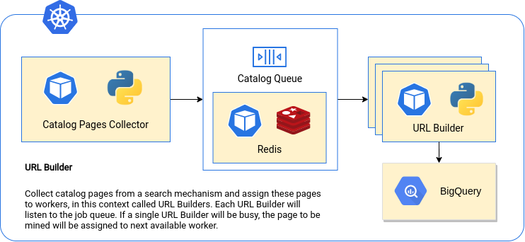

# URL Builder

Fetch and store article links from several scientific websites.

## Architecture

To achieve scalability and distribuition of the system, I take an approach of distributing search pages from a website query to several worker running on a Kubernetes ReplicaSet. To make this work, a single Python application will take the query as a user input and build a list of URLs with search results to be sent to a Redis Pub/Sub queue. At any time, the URL builders can receive a job through this queue and start to work with it. If a URL Builder is currently working on a given search result page, the next one will be addressed to the next available replica. To make this work, the URL Builders will have to continuously listen to queue requests. To maintain a minimal number of builders working, we should use the GKE autoscaling function.

## Installation

All you need to have to run these applications is the Docker environment set up and ready to container deployment. In this example, I'm assuming that the user has privileges on the `docker` group. If doesn't, the best workaround is to check the [Docker docs](https://docs.docker.com/engine/install/linux-postinstall/) regarding this topic or to execute all the following commands as super user (`sudo`).

This setup uses `redis` as the caching database / message broker. Therefore, it's suggested to pull the Redis image from the DockerHub with

    $ docker pull redis

## Getting Started

### General Advice

1. This container was tested only in Google Compute Engine VMs, so this should be a good starting point to run this application. This is a good piece of advice, as we don't recommend doing web scraping on your local machine. To get things working easily, create this VM with a Service Account with read and write permissions to BigQuery.

### Docker 

To get this system running on a pure docker environment, it's required to set up a new network which will connect all the containers with the caching database. First of all, let's create our own private network with a `bridge` driver. 

    $ docker network create -d bridge pcn

With our new private container network, we can start deploying the database, which will give access to the subscription system. We will name it as `redis-server`, and we'll use this as a DNS address to connect our other applications to this database. If you want to name it in other way, you'll have to update the environment variable `REDIS_SERVICE_HOST` on the subsequent container deployments.

    $ docker run -d --rm --network pcn --name redis-server redis

With the caching database set, we can build and execute our catalog collector application. 

    $ docker build -t collector catalog_collector
    $ docker run --rm --network pcn collector KEYWORDS [LIMIT]

The purpose of this container is to run a job batch process. We define several keywords as the container parameters, with an option to declare the limit of articles to retrieve or not. If the `LIMIT` is not defined, all the search pages will be gathered and dumped into the Redis queue.

After the execution, several search pages will be available to the URL Builders to dump article links at the Google BigQuery. In this case, we can run the following commands.

    $ docker build -t builder urlbuilder
    $ docker run --rm --network pcn                                 \
        --env PROJECT_ID='my-project'                               \
        --env TABLE_ID='my-dataset.my-table'                        \
        --env GOOGLE_APPLICATION_CREDENTIALS='my-credentials.json'  \
        builder

The credentials file must be setup accordingly on the urlbuilder directory, as `credentials.json`, and with read and write privileges to BigQuery.

### Available Websites

- `scielo`